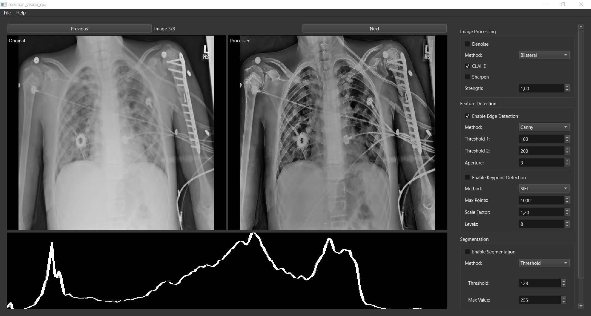
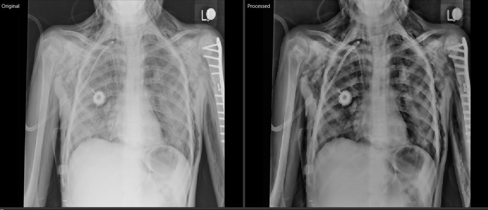
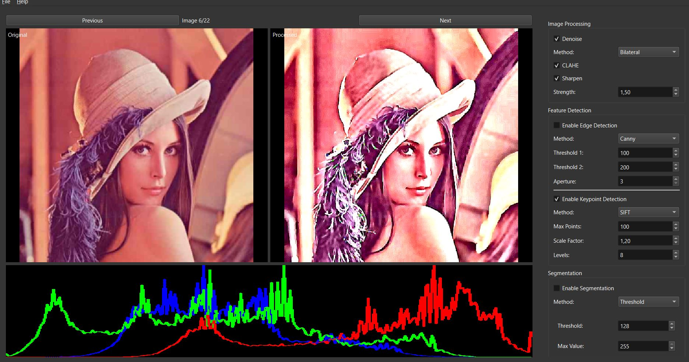
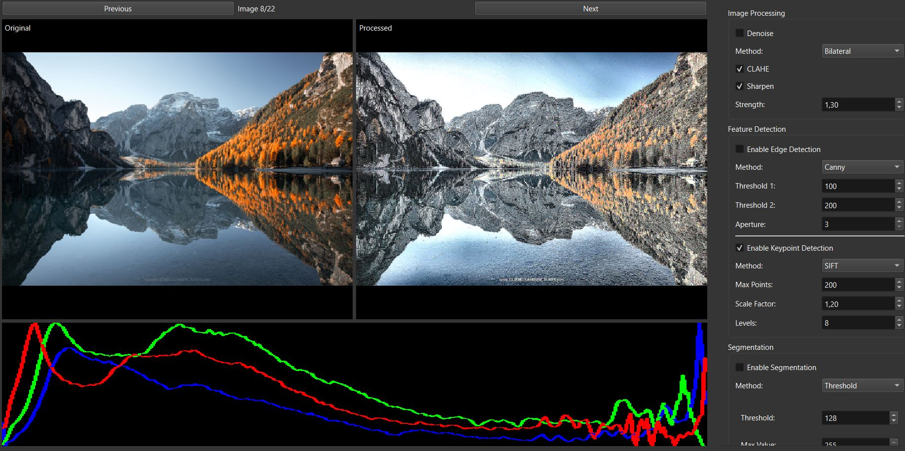

# MedicalVision Library

A modern C++ library for medical image processing with a focus on chest X-ray analysis.

<div align="center">
  
  <p><i>MedicalVision Interface Overview with Chest X-ray Analysis.
    Infiltration and Mass Detection (00006585_010_InfiltrationMass) with Edge Enhancement. </i></p>
</div>

## Features Showcase

### Medical Image Processing


#### 1. Complex Case Analysis
<div align="center">
  
  <p><i>Multiple Conditions (00006585_017AtelectasisEmphysemaPneumothorax) - Enhanced Visualization</i></p>
</div>

### Feature Detection

#### Classic Image Processing
<div align="center">
  
  <p><i>Lena - Original, CLAHE Enhanced, Edge Detection</i></p>
</div>

#### Natural Scene Analysis
<div align="center">
  
  <p><i>Mountain Scene - SIFT Keypoint Detection</i></p>
</div>

## Features

- **Image Processing**
  - Advanced preprocessing techniques
  - Histogram analysis
  - Noise reduction
  - Contrast enhancement

- **Feature Detection**
  - Edge detection (Canny, Sobel, Laplacian)
  - Keypoint detection (SIFT, ORB, FAST)
  - Feature visualization

- **Segmentation**
  - Threshold-based methods
  - Adaptive thresholding
  - Watershed segmentation

## Requirements

- C++17 or higher
- OpenCV 4.10.0
- Qt 6.7.3
- CMake 3.14+

## Installation

1. **Clone the repository**
```bash
git clone git@github.com:aarid/medical_vision.git
cd medical_vision
```

2. **Install dependencies**
- OpenCV 4.10.0: [Download](https://opencv.org/releases/)
- Qt 6.7.3: [Download](https://www.qt.io/download)

3. **Build the project**
```bash
mkdir build
cd build
cmake ..
cmake --build . --config Release
```

## Quick Start

1. **Run the application**
```bash
./medical_vision_gui
```

2. **Load test images**
- Use the provided test samples in `data/test_samples/`
- Click "File > Open Folder" and select the test samples directory

3. **Try different processing methods**
- Apply various image processing techniques
- Detect features
- Experiment with segmentation

## Test Samples

The `data/test_samples/` directory contains example chest X-ray images for testing and other images:

## Project Structure

```
medical_vision/
├── include/              # Header files
├── src/                 # Source files
├── gui/                 # GUI implementation
├── data/                # Test data
│   └── test_samples/    # Sample images
├── docs/                # Documentation
└── examples/            # Usage examples
```

## Documentation

- [User Guide](docs/user_guide.md)


## License

This project is licensed under the MIT License.

## Acknowledgments

- NIH Chest X-ray Dataset
